Practices for Lesson 9: Using Oracle Machine Learning with Autonomous Database
==============================================================================

Practices for Lesson 9: Overview
--------------------------------

### Overview

In these practices, you create a project and a workspace in Oracle
Machine Learning.

**Note:** The initial workspace and the default project are created by
the Oracle Machine Learning service automatically when you log in to
Oracle Machine Learning for the first time. The term default applies to
the last project that you work on, and it is stored in the browser
cache. If you clear the cache, there would be no default project
selected. Then, you must select a project to work with notebooks.

### Assumptions

-   As part of your course environment, SQL Developer is installed on
    your local system.

-   All previous practices are completed successfully.

Practice 9-1: Creating Projects and Workspaces in Oracle Machine Learning
-------------------------------------------------------------------------

### Overview

In this practice, you create a project and a workspace in Oracle Machine
Learning.

A project is a container for your notebooks, and a workspace is a
container for your projects. You can own multiple projects in a
workspace.

### Tasks

Log in to your assigned Oracle Cloud account as described in the
previous practices.

Navigate to the **Autonomous Databases** page and click your service
instance name (in this example, the name of the instance is
**TRAINING**).

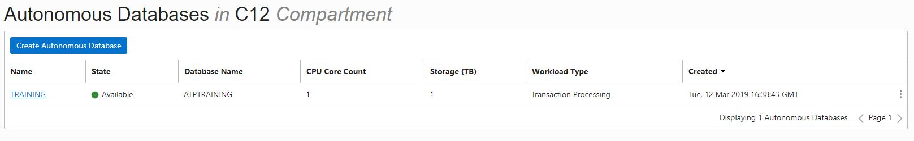

On the instance information page, click **Service Console**.

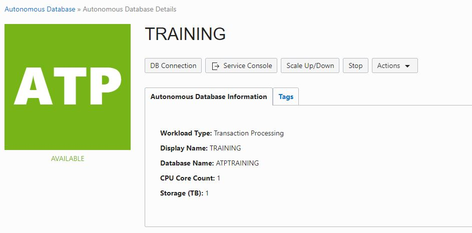

This will open a new browser tab for the service console. If prompted,
sign in to the service console as the **admin** user.

On the left hand menu, click **Administration**.

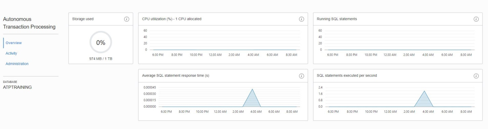

Click **Manage Oracle ML Users**.

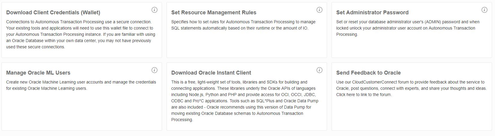

This will open a new browser tab for the Machine Learning User
Administration page, as shown below. If prompted, sign in as **admin**
user.

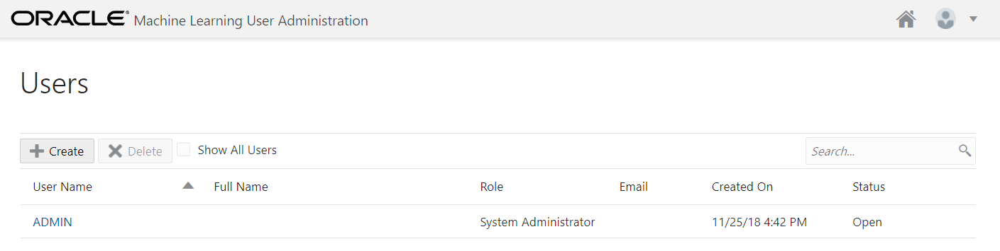

Click

and create the **MLADMIN** user, as shown below. Only enter mandatory
(\*) fields and click **Create**. For your convenience during the
practice session, you can choose to use the same password you used for
the admin account.

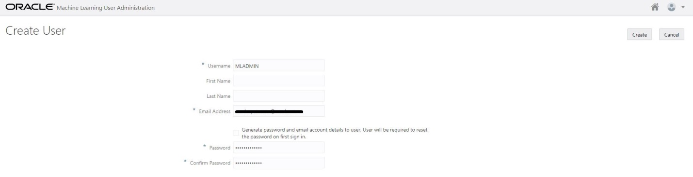

This completes the task of OML user account creation. The following
screenshot confirms you now have two OML user accounts.

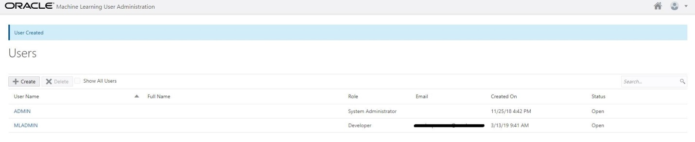

Create projects and workspaces in Oracle Machine Learning.

Click **Oracle Machine Learning** **Home**

on the top right corner of the User Administration page. You will be
prompted to enter a username and password (in this example, it will be
**MLADMIN** and its password).

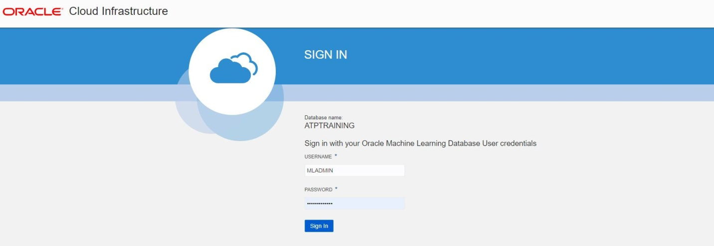

After you are logged in, you can see the default project and workspace
displayed on the top right side of the window. In this example,
**MLADMIN Project** is the project and **MLADMIN Workspace** is the
workspace because you logged in using the **MLADMIN** account. To create
a new project, click **New Project**.

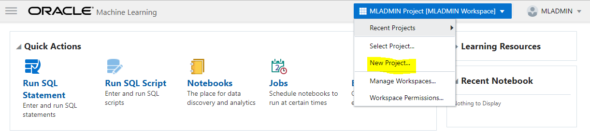

In the **Create Project** window, enter the **Name** and **Comment** for
the project and click **+.** In the **Create Workspace** window, enter
the **Name** and **Comment** for the workspace and click **OK**. Back on
the **Create Project** window, click **OK** again.

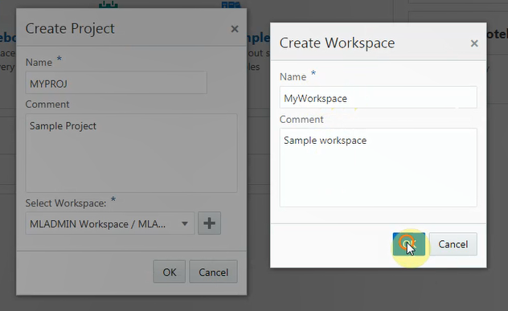

Still logged in as the **MLADMIN** user, you are now in the newly
created project and workspace.

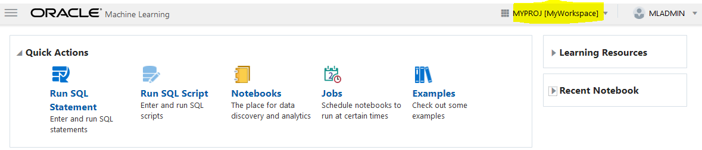

Practice 9-2: Creating and Running Notebooks in Oracle Machine Learning
-----------------------------------------------------------------------

### Overview

In this practice, you create a notebook and run it in Oracle Machine
Learning.

### Tasks

Log in to your Oracle Cloud account.

Navigate to the **Autonomous Databases** page where your instance is
listed.

Click your instance name.

Click the **Service Console** option:

Log in as the **admin** user. Here, you are signing in to the Oracle
Autonomous Transaction Processing console.

On the left hand menu, click **Administration**.

Click **Manage Oracle ML Users**.

Log in as the **admin** user. Here, you are signing in to the Oracle
Machine Learning console.

Click **Home** on the right hand top corner, highlighted in the
following screenshot:

Log in as the **MLADMIN** user. This time, you are signing in to the
Oracle Machine Learning console as the **MLADMIN** user.

Ensure you are in the **MYPROJ \[MyWorkspace\]** project and workspace,
which was created in the previous project. If not, change the project
using the **Select Project** menu option from the project/workspace
drop-down list, highlighted in the following screenshot:

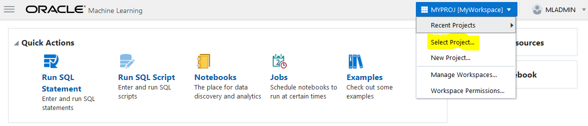

On the Oracle Machine Learning home page, click **Notebooks**.

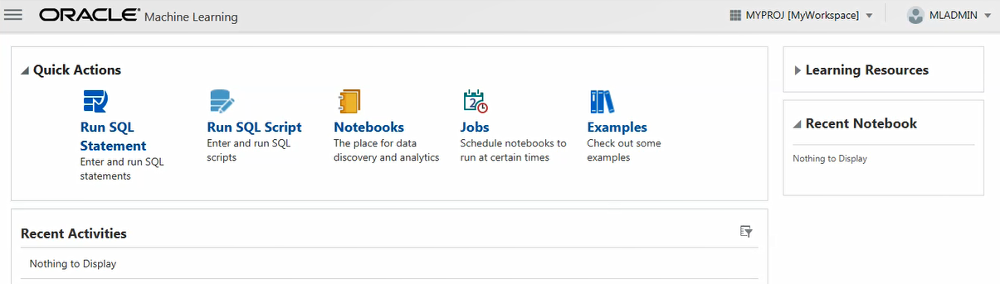

In the **Notebooks** action item, click **Create**.

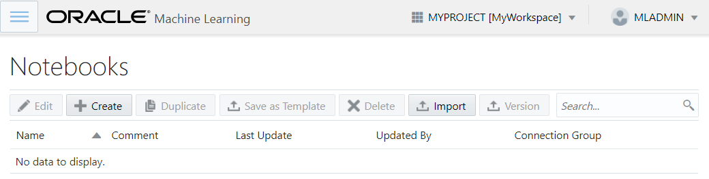

In the **Create Notebook** window, enter **Name**, **Comment,** and
**Global** as a connection string. After you click the **OK** button,
you will get your notebook ready, as in the following screenshot. In
this case, MYNOTEBOOK is the notebook name.

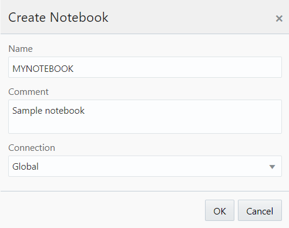

In the newly created notebook, you can enter SQL commands and run them.

In the notebook editor type, use the following SQL statements to fetch
data from an Oracle Database:

We are using the table name **tab** in this example as we do not have
any tables yet in this database. Ensure you have **%sql** as the first
line of the editor. Click **Run** next to the **READY** sign when you
are ready.

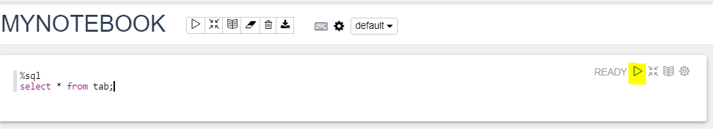

You can run a notebook by clicking the **Run** icon next to the
**READY** sign. This is a single paragraph run. Alternatively, you can
press **Shift+Enter**.

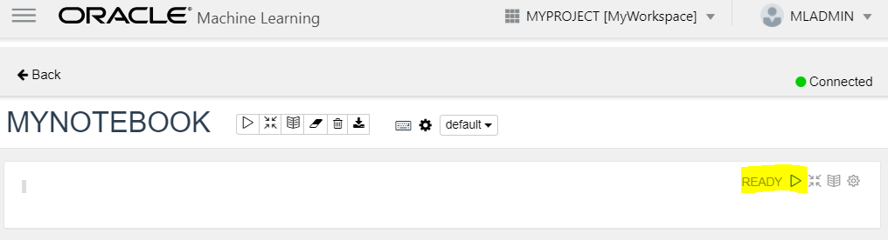

For a multiscript or multiparagraph run, which is also called an all
paragraph run, click **Run** next to the notebook name.

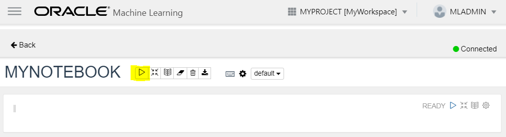

In order to perform data analysis and data visualization, you must first
fetch data in a notebook from the data source. There are three ways in
which you can fetch data into notebooks:

Run SQL Statement

Run SQL Script

Create Notebooks

You can see these three options on the Oracle Machine Leaning home page,
as shown in the following screenshot:

In the next practice, you perform more tasks with SQL statements and SQL
scripts.

Practice 9-3: Creating SQL Scripts in Oracle Machine Learning
-------------------------------------------------------------

### Overview

In this practice, you create a SQL script in Oracle Machine Learning.

### Tasks

Log in to your Oracle Cloud account.

Navigate to the **Autonomous Databases** page where your instance is
listed.

Click your instance name.

Click the **Service Console**

option.

Log in as the **admin** user. Here, you are signing in to the Oracle
Autonomous Transaction Processing console.

On the left hand menu, click **Administration**.

Click **Manage Oracle ML Users**.

Log in as the **admin** user. Here, you are signing in to the Oracle
Machine Learning console.

Click **Home**

on the right hand top corner.

If you had signed out, you will be prompted to log in. Log in as the
**MLADMIN** user.

Ensure you are in the **MYPROJ \[MyWorkspace\]** project and workspace,
which was created in the previous project. If not, change the project
using the **Select Project** menu option from the project/workspace
drop-down list.

If you are continuing from the previous practice, just click the
**Application Navigation** menu (highlighted in the following
screenshot) and click **Home**.

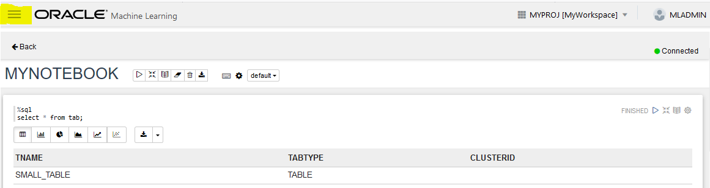

Click **Run SQL Script**.

You will find the **%script** tag in the beginning of the scratch pad.
Do not delete it. Let this be the first line. Copy and paste the
following SQL script into the scratch pad:

Create table small\_table

(

name varchar(200),

id1 integer,

id2 varchar(200),

id3 varchar(200),

id4 varchar(200),

TEXT varchar(200)

);

begin

for i in 1..100 loop

insert into small\_table
values('Name\_\_\_\_\_'\|\|i,i,'ID2\_'\|\|i,'ID3\_'\|\|i,'ID4\_'\|\|i,'TEXT\_'\|\|i);

end loop;

commit;

end;

Click **Run** next to the SQL Script Scratchpad and click **OK** in the
confirmation window. The script executes and you will see the successful
execution message.

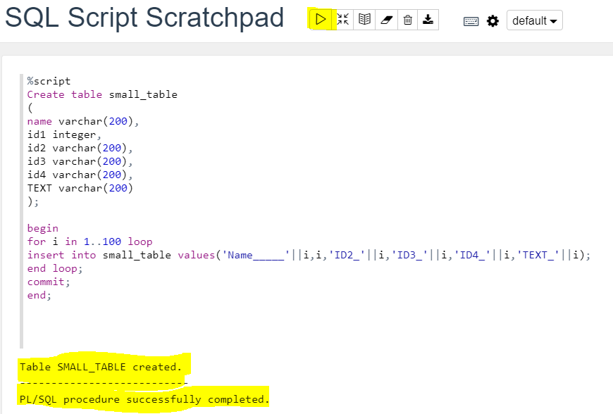

SQL scripts can be saved on your system as a **.json** file by clicking
the **Export the notebook** option.

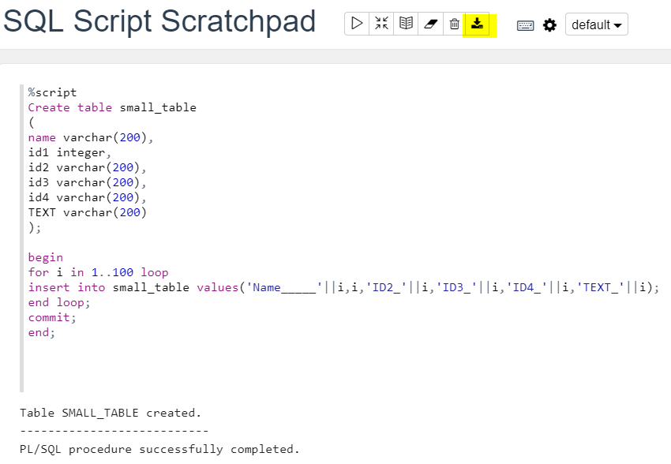

SQL scripts that are stored as **.json** files can also be imported by
clicking **Import** in the **Notebooks** home page. This is called
**Import SQL Script**.

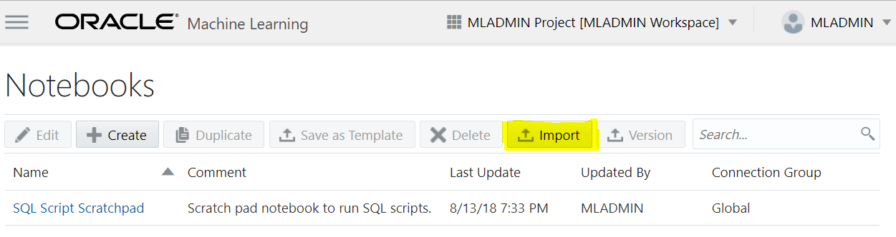

Practice 9-4: Running SQL Statements in Oracle Machine Learning
---------------------------------------------------------------

### Overview

In this practice, you run SQL statements in Oracle Machine Learning.

### Tasks

Log in to your Oracle Cloud account.

Navigate to the **Autonomous Databases** page where your instance is
listed.

Click your instance name.

Click the **Service Console**
option.

Log in as the **admin** user. Here, you are signing in to the Oracle
Autonomous Transaction Processing console.

On the left hand menu, click **Administration**.

Click **Manage Oracle ML Users**.

Log in as the **admin** user. Here, you are signing in to the Oracle
Machine Learning console.

Click **Home**

on the right hand top corner.

Log in as the **MLADMIN** user. This time, you are signing in to the
Oracle Machine Learning console as the **MLADMIN** user.

Perform these tasks to run SQL statements.

On the Oracle Machine Learning home page, click **Run SQL Statement**.

If there are SQL statements from a previous run, click **Clear
notebook** and click **OK** to clear the scratchpad.

In the SQL Query Scratchpad, type **%sql** as the first line and press
**Enter**.

Enter the SQL statement in the SQL Query Scratchpad and press **Shift +
Enter**:

The result is displayed as follows:

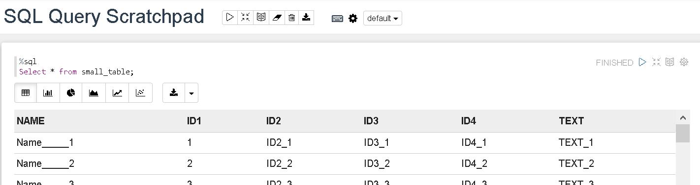

Perform these tasks to visualize data using Oracle Machine Leaning.

Continue from the previous step and click one of the chart options.

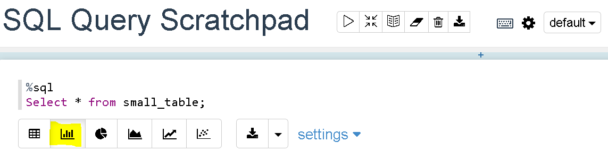

A corresponding chart is displayed.

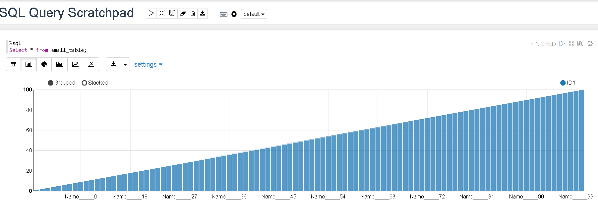

This way, you can use the **Run SQL Statement** option to run SQL
statements and visualize data. This completes the task of running a SQL
statement.

Practice 9-5: Scheduling Jobs in Oracle Machine Learning
--------------------------------------------------------

### Overview

In this practice, you schedule a job to run in Oracle Machine Learning.

### Tasks

Log in as the **MLADMIN** user into the Oracle Machine Learning console
as shown in the previous practices. Create a notebook using the
following SQL statements. Refer to Practice 4-2 for instructions on how
to create a notebook.

This is how the notebook will look. After you are done, click the
**Application Navigation** menu and click **Home** to go back to the
home page.

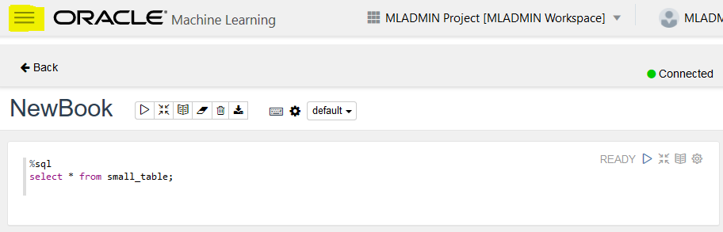

To create a job, click **Jobs**.

Click **Create**, as shown in the following screenshot:

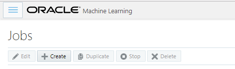

Enter the following details in the **Create Job** window:

Name: **MyJob1**

Notebook: Click the search icon, expand your workspace
(**MyWorkspace)**, select your notebook, and click **OK**. In this
example, we are scheduling a notebook called *new book*.

Enter the Start Date and Time. Select the current date and time.

Enter the Repeat Frequency as every **2 minutes**.

Click **Advanced Settings** and enter value 2 for **Maximum Number of
Runs** and **Maximum Failures Allowed**.

Finally, click **OK**.

The following screenshot is for a job schedule with a repeat frequency
of 2
minutes.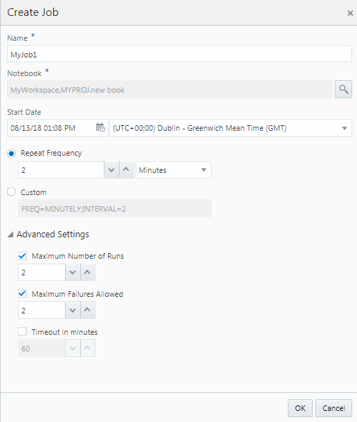

After the job is created, its status can be tracked. The status changes
from Scheduled to Running and Success periodically.

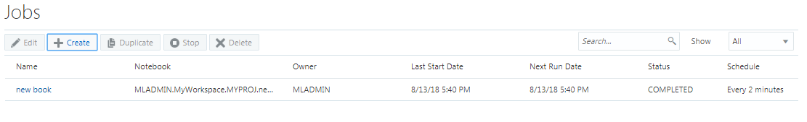

Click the job name. Select a row, that is a time frame, and click
**View**

to get the run details and output along with the time stamp.

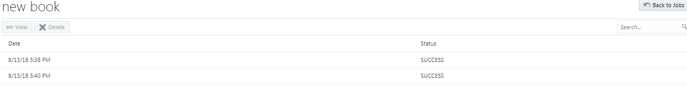

To stop a job, go back to the **Jobs** page. Select your job (that is,
select the row listing your job), click **Stop,** and click **OK**.

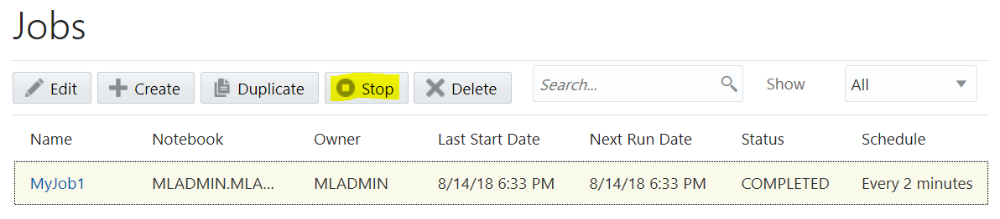

To delete a job, go to the **Jobs** page, select your job (that is
select the row listing your job), click **Delete**, and click **OK**.

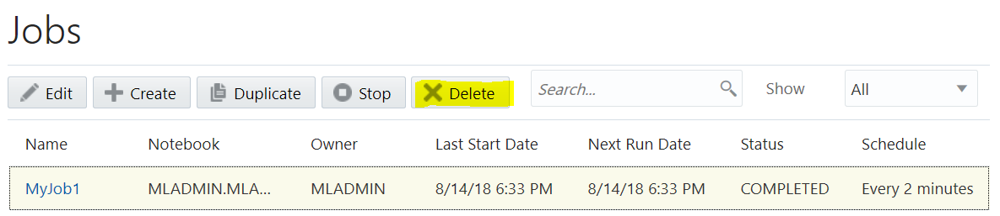

This completes the task of creating and working with a project and
workspace in Oracle Machine Learning.
